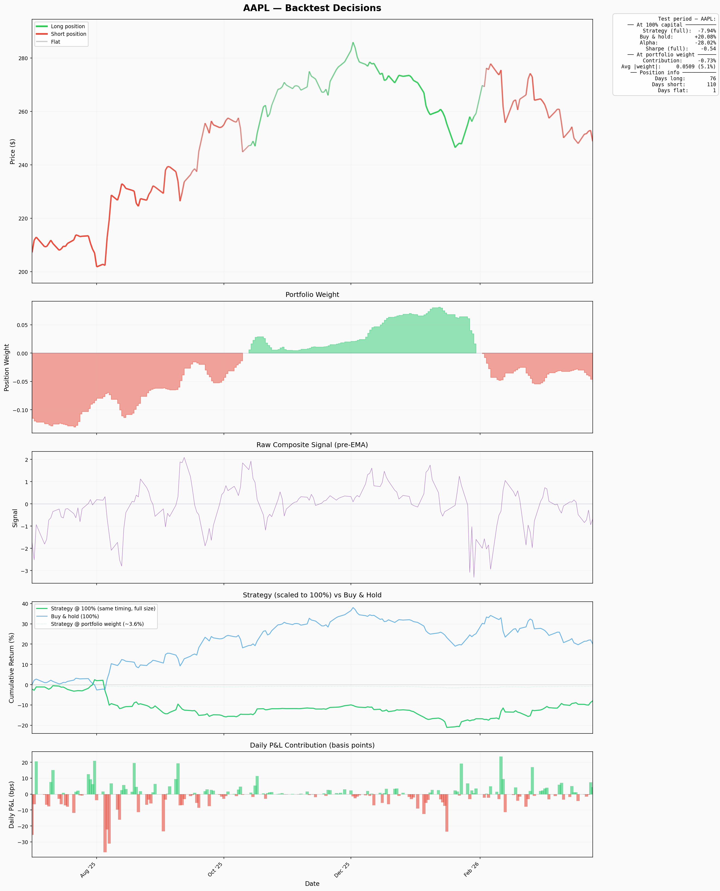
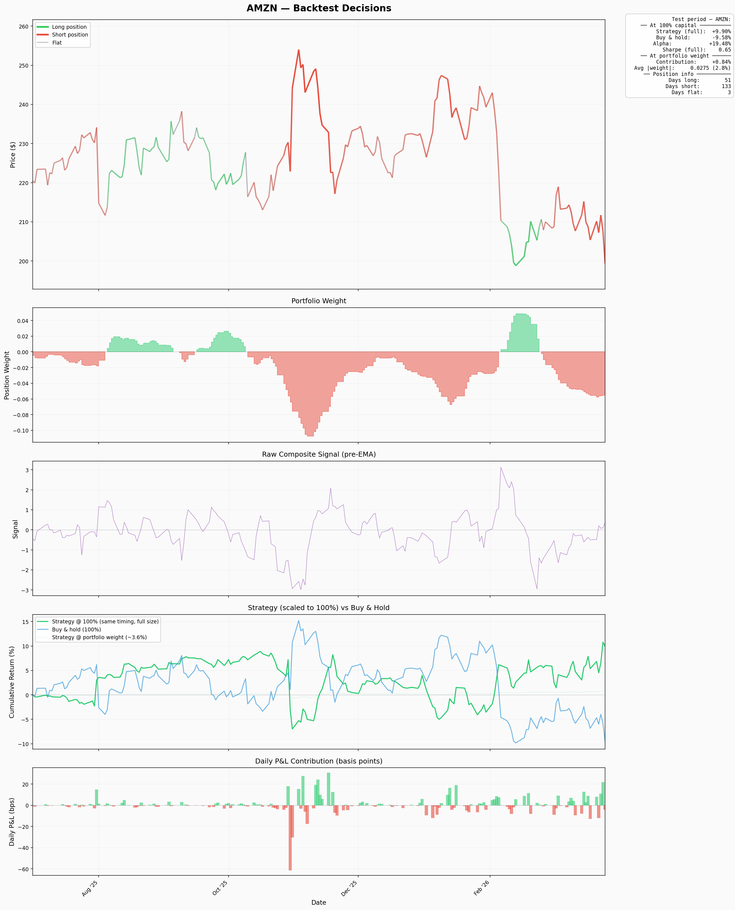
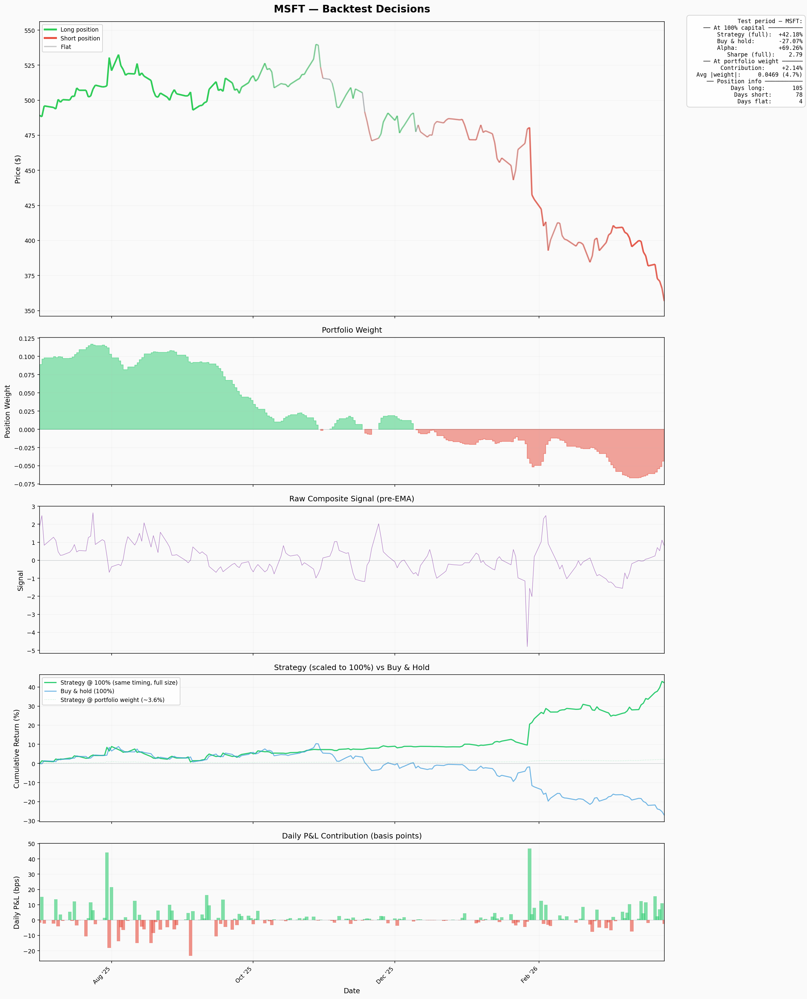
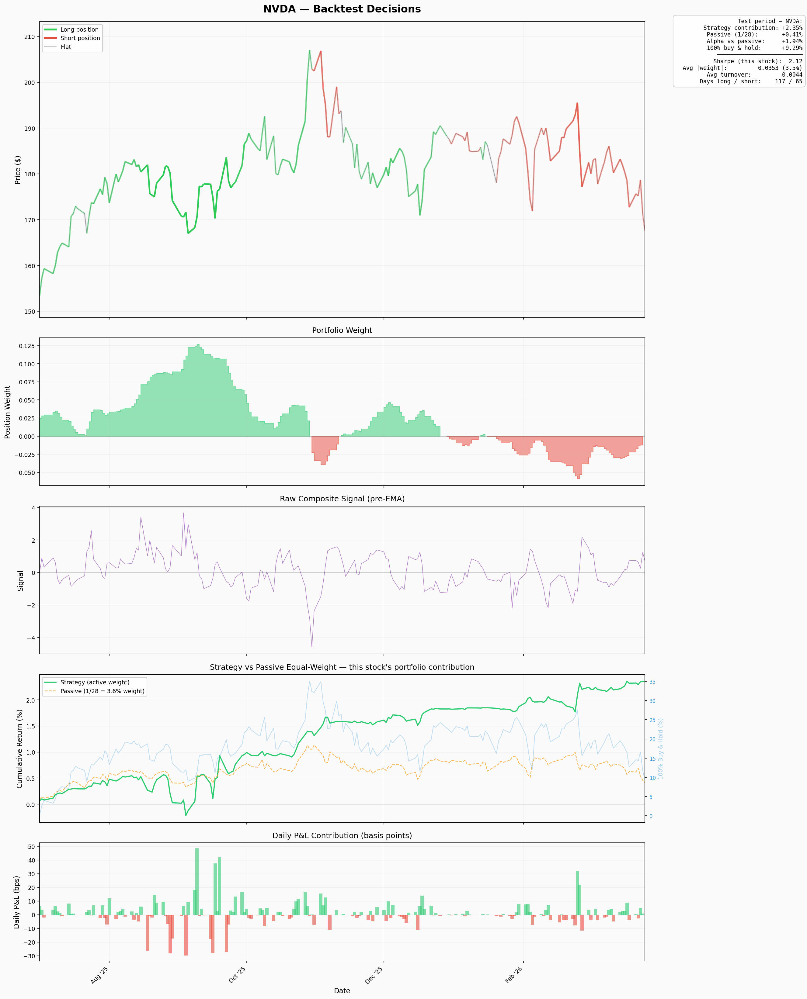
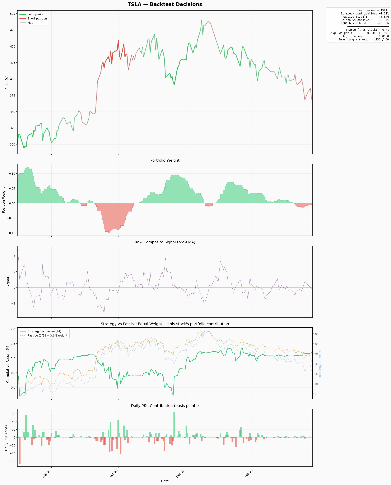

# autoresearch-trader

The idea: give an AI agent a small but real stock trading setup. It modifies the code, trains for 5 minutes, checks if the result improved, keeps or discards, and repeats. You wake up in the morning to a log of experiments and (hopefully) a better model.

## Mar31 v22 - Backtest

Sharpe: 3.2950
Return: 14.93%